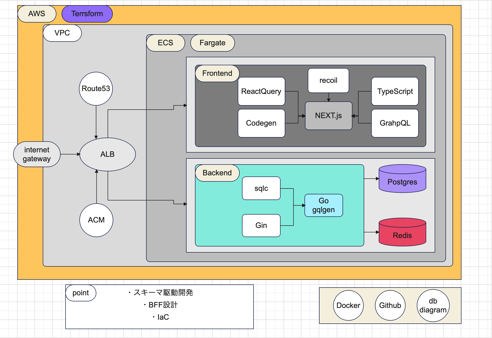
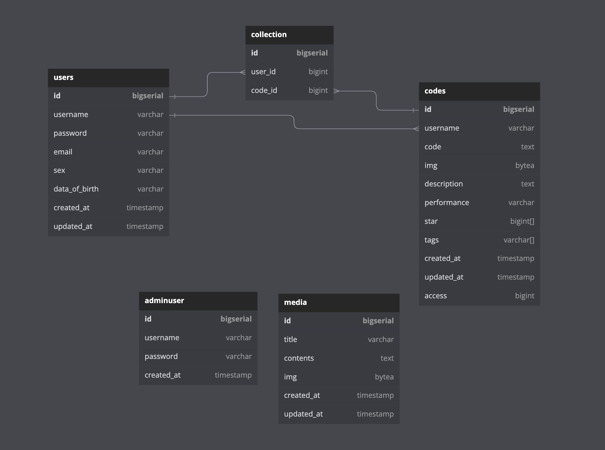

command-style
<code></code>
<code></code>

design OK
input tags OK
tag search OK
sort star OK
sort access OK
update access OK
collection sort function SQL OK
toggle star OK
create code row display frontend OK
user manage display OK
anime.js modal star OK
no session in local storage -> redis cookie bearer paseto

fetcher typescript error -> on hold because @ts-ignore
OAuth -> google, github, facebook -> on hold because no session identify key
editor embed -> on hold
three.js -> on hold because process cost, time cost

specification
debug
aggregation

login user image show

-   frontend
    React - Next.js
    sass - scss
    react-query
    recoil
    material ui
    story-book
    jest
    eslint
    prettier

-   API
    GraphQL
    codegen

-   backend
    Go (gqlgen, dataloader, gin, sqlc, colly)

-   database
    postgres (pgx/v4, dataloader, zerolog)
    redis

-   infra
    AWS (EC2, ECS, ALB)
    terraform
    docker

-   Saas
    github
    github actions
    circle CI

**architecture**

-   MVC

    -   frontend
        model:
        view:
        controller:

    -   backend
        model: db, token, config, colly -> graph server gin handler
        view: resolver
        controller: graph server
